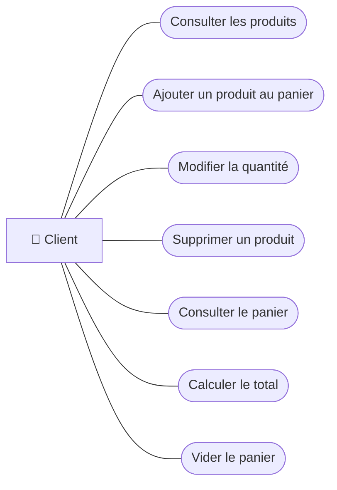

# Diagramme des cas d'utilisation

## Acteur principal : Client

```mermaid
flowchart LR
    C["👤 Client"]

    C --- A(["Consulter les produits"])
    C --- B(["Ajouter un produit au panier"])
    C --- D(["Modifier la quantité"])
    C --- E(["Supprimer un produit"])
    C --- F(["Consulter le panier"])
    C --- G(["Calculer le total"])
    C --- H(["Vider le panier"])
```
